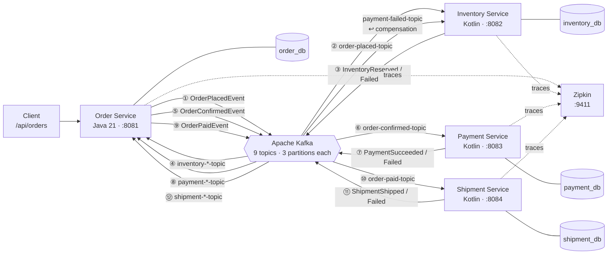

# Event-Driven Distributed Commerce API

A production-minded, polyglot Order Management System built a distributed systems design. Four independently deployable services coordinate a multi-step business transaction order creation, inventory reservation, payment processing, and shipment using the **Choreography Saga Pattern** over Apache Kafka, with full compensation on failure.

---

## Tech Stack


---

## Why This Project

- **Saga compensation, not just happy paths** when payment fails, the system automatically releases the previously reserved inventory. No orchestrator. No shared state. Just well-designed event contracts.
- **Polyglot by design**  Order Service in Java 21; Inventory and Payment services in Kotlin 2.1.10. The language choice follows the team, not a rule.
- **Production-grade from the start**  Flyway migrations, idempotent consumers, structured observability, Helm charts for Kubernetes, and a full CI/CD pipeline. Nothing is left as a "nice to have."
- **Database-per-service** each service owns its schema. No shared tables, no shared connections.
- **Independently testable** every service has integration tests using real databases and real Kafka brokers via Testcontainers. No mocks at the infrastructure boundary.

---

## Engineering Highlights

### Choreography Saga with Compensation
The full saga spans four services and nine Kafka topics. When payment fails, a `PaymentFailedEvent` triggers inventory to release its reservation restoring the system to a clean state with no central coordinator. The failure path is as well-tested as the happy path.

### Idempotent Kafka Consumers
Every consumer maintains a `processed_*_events` table keyed on the event UUID. Kafka redeliveries are safely absorbed without side effects. This pattern is applied identically across all four services.

### Polyglot Architecture
The Order Service is written in Java 21 using records, sealed types, and Spring Boot idioms. The Inventory, Payment, and Shipment services are written in Kotlin 2.1.10 using data classes, extension functions, and Kotest for expressive tests. Each language is used where it fits the team writing it.

### Distributed Tracing
All four services are instrumented with **Micrometer Tracing + Brave** and report spans to **Zipkin** at 100% sampling. The local environment ships with a Zipkin container cross-service saga traces are visible out of the box.

### Helm Charts for Kubernetes
Each service has a production-ready Helm chart with separate `dev` and `prod` value overrides, HPA configuration, liveness/readiness probes, a Kubernetes `Secret` for database credentials, and a `ConfigMap` for environment-specific settings.

### Full CI/CD Pipeline
GitHub Actions runs on every push and pull request: Maven build and Testcontainers integration tests for all four services, Docker image builds, and Helm `lint` + `template` dry-runs for all eight value combinations. The pipeline fails fast on any of these gates.

### Strict Event Contracts
Kafka event payloads are defined as dedicated Java records and Kotlin data classes never JPA entities. The persistence model never leaks into the event bus.

---

## Architecture



---

## The Full Saga

### Happy path — order placed, inventory reserved, payment succeeds

| Step | Actor | Action | Outcome |
|------|-------|--------|---------|
| 1 | Client | `POST /api/orders` | — |
| 2 | Order Service | Persists order as `PENDING`, publishes `OrderPlacedEvent` | → `order-placed-topic` |
| 3 | Inventory Service | Validates stock, deducts reservation | — |
| 4 | Inventory Service | Publishes `InventoryReservedEvent` | → `inventory-reserved-topic` |
| 5 | Order Service | Transitions to `CONFIRMED`, publishes `OrderConfirmedEvent` | → `order-confirmed-topic` |
| 6 | Payment Service | Processes charge, publishes `PaymentSucceededEvent` | → `payment-succeeded-topic` |
| 7 | Order Service | Transitions to `PAID` | — |
| 8 | Order Service | Publishes `OrderPaidEvent` | → `order-paid-topic` |
| 9 | Shipment Service | Processes shipment, publishes `ShipmentShippedEvent` | → `shipment-shipped-topic` |
| 10 | Order Service | Transitions to `SHIPPED` | — |

### Failure path A — insufficient inventory

| Step | Actor | Action | Outcome |
|------|-------|--------|---------|
| 3 | Inventory Service | Insufficient stock | — |
| 4 | Inventory Service | Publishes `InventoryFailedEvent` | → `inventory-failed-topic` |
| 5 | Order Service | Transitions to `FAILED` | — |

### Failure path B — payment declined (saga compensation)

| Step | Actor | Action | Outcome |
|------|-------|--------|---------|
| 6 | Payment Service | Charge declined, publishes `PaymentFailedEvent` | → `payment-failed-topic` |
| 7a | Order Service | Transitions to `PAYMENT_FAILED` | — |
| 7b | Inventory Service | Consumes `payment-failed-topic`, releases reservation | Compensation complete |

### Failure path C — shipment failed

| Step | Actor | Action | Outcome |
|------|-------|--------|---------|
| 9 | Shipment Service | Carrier rejected, publishes `ShipmentFailedEvent` | → `shipment-failed-topic` |
| 10 | Order Service | Transitions to `SHIPMENT_FAILED` | — |

---

## Services

| Service | Language | Port | Database | Responsibility |
|---------|----------|------|----------|----------------|
| `order-service` | Java 21 + Spring Boot 3.4.3 | 8081 | `order_db` | REST entry point, saga orchestration state machine |
| `inventory-service` | Kotlin 2.1.10 + Spring Boot 3.4.3 | 8082 | `inventory_db` | Stock reservation and release |
| `payment-service` | Kotlin 2.1.10 + Spring Boot 3.4.3 | 8083 | `payment_db` | Charge processing and outcome publishing |
| `shipment-service` | Kotlin 2.1.10 + Spring Boot 3.4.3 | 8084 | `shipment_db` | Shipment processing and outcome publishing |

---

## Repository Structure

```text
.
├── docker-compose.yml                  # Full local stack: Postgres, Kafka, Kafka UI, Zipkin, Redis, API Gateway
├── docker/
│   └── postgres/init/
│       └── 01-create-databases.sql     # Initialises order_db, inventory_db, payment_db, shipment_db
├── helm/
│   ├── order-service/                  # Helm chart: deployment, service, HPA, secret, configmap
│   ├── inventory-service/
│   └── payment-service/
├── order-service/                      # Java 21 · Spring Boot
│   ├── src/main/java/
│   └── src/main/resources/db/migration/
├── inventory-service/                  # Kotlin · Spring Boot
│   ├── src/main/kotlin/
│   └── src/main/resources/db/migration/
├── payment-service/                    # Kotlin · Spring Boot
│   ├── src/main/kotlin/
│   └── src/main/resources/db/migration/
└── shipment-service/               # Kotlin · Spring Boot
    ├── src/main/kotlin/
    └── src/main/resources/db/migration/
```

---

## How to Run Locally

### 1. Start the infrastructure

```bash
docker compose up -d
```

This starts:

| Container | URL | Purpose |
|-----------|-----|---------|
| PostgreSQL | `localhost:5432` | Four logical databases (`order_db`, `inventory_db`, `payment_db`, `shipment_db`) |
| Kafka (KRaft) | `localhost:9094` | Message broker, topics auto-created on first use |
| Kafka UI | `http://localhost:8090` | Browse topics, consumer groups, and message payloads |
| Zipkin | `http://localhost:9411` | Distributed trace viewer across all four services |
| Redis | `localhost:6379` | Rate-limit counters and token cache for the API gateway |
| API Gateway | `http://localhost:8080` | Single entry point — JWT auth, rate limiting, and routing to all services |

### 2. Start the services (each in a separate terminal)

The API gateway (`http://localhost:8080`) is now the single entry point for all client requests. Route traffic through it rather than calling individual services directly.

```bash
# Terminal 1
cd order-service && mvn spring-boot:run

# Terminal 2
cd inventory-service && mvn spring-boot:run

# Terminal 3
cd payment-service && mvn spring-boot:run

# Terminal 4
cd shipment-service && mvn spring-boot:run
```

### 3. Seed inventory

```bash
curl -s -X POST http://localhost:8082/api/inventory \
  -H "Content-Type: application/json" \
  -d '{"productId": 1, "quantity": 100}'
```

### 4. Place an order and trace the saga

```bash
curl -s -X POST http://localhost:8081/api/orders \
  -H "Content-Type: application/json" \
  -d '{"productId": 1, "quantity": 2, "price": 49.99}'
```

Then:
- **Kafka UI** (`http://localhost:8090`) — inspect events flowing through all nine topics
- **Zipkin** (`http://localhost:9411`) — view the distributed trace spanning all four services
- **Order status** — `GET http://localhost:8081/api/orders/{id}` should reach `PAID`

---

## Testing

### Strategy

All four services have two test layers:

| Layer | Scope | Tools |
|-------|-------|-------|
| Unit tests | Service-layer business logic in isolation | JUnit 5 / Kotest + MockK |
| Integration tests | Full consumer → service → producer flow against real infrastructure | Testcontainers (PostgreSQL 16, Kafka native 3.8.0) |

All async assertions use condition-based polling. `Thread.sleep()` does not appear in the test suite.

### Patterns worth noting

- **Idempotency tested explicitly** — `PaymentSagaIntegrationTest` delivers the same `OrderConfirmedEvent` twice and asserts exactly one payment record is persisted.
- **Compensation tested explicitly** — `InventorySagaIntegrationTest` verifies that a `PaymentFailedEvent` releases a previously reserved stock quantity.
- **Isolated Spring contexts** — the payment-service success and failure scenarios each run in their own `@SpringBootTest` context with a unique Kafka consumer group, ensuring partition ownership and no cross-context interference.

### Running the tests

```bash
# Run all tests (requires Docker)
cd order-service     && mvn test
cd inventory-service && mvn test
cd payment-service   && mvn test
cd shipment-service  && mvn test

# Unit tests only (no Docker required)
cd order-service     && mvn test -DskipIntegrationTests
cd inventory-service && mvn test -DskipIntegrationTests
cd payment-service   && mvn test -DskipIntegrationTests
cd shipment-service  && mvn test -DskipIntegrationTests
```

---

## CI/CD

The GitHub Actions workflow (`Polyglot CI/CD`) runs on every push to `main`/`develop` and on every pull request targeting `main`.

**Pipeline stages:**

1. **Pre-pull Testcontainers images** — `postgres:16-alpine` and `apache/kafka-native:3.8.0` are pulled before any service builds to avoid cold-start timeouts.
2. **Build and test** — `mvn clean verify` for all four services with the `test` Spring profile active.
3. **Docker image build** — each service image is built from its multi-stage `Dockerfile`.
4. **Helm lint** — all eight value combinations (`dev` + `prod` × four services) are linted.
5. **Helm template dry-run** — all eight combinations are rendered to catch template errors without a cluster.

Test reports are uploaded as artifacts on failure for post-mortem analysis.

---

## Next Steps

- **API Gateway** — single entry point with rate limiting and routing across services
