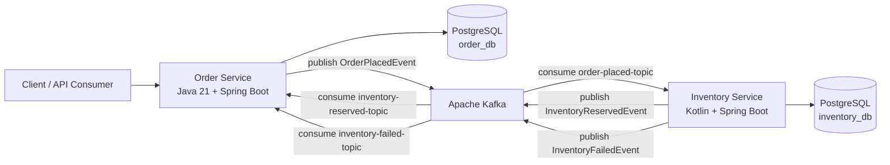

# Event-Driven Polyglot Order Management System

An event-driven Order Management System (OMS) built as a portfolio project to demonstrate distributed systems design, polyglot service development, and production-minded engineering practices for modern backend teams.

The project models a realistic commerce workflow in which order creation and inventory reservation are coordinated through Apache Kafka using the Choreography Saga Pattern. The result is a resilient, loosely coupled architecture designed for eventual consistency, service autonomy, and operational clarity.

## Why This Project

This repository is designed to showcase the kind of decisions expected from a Senior Software Engineer:

- decomposing business capabilities into independently deployable services
- using Java and Kotlin where each language is a good fit
- applying choreography-based sagas instead of tight synchronous coupling
- protecting service boundaries with DTOs, dedicated event contracts, and idempotent consumers
- building for reliability with Flyway migrations, structured error handling, and integration testing

## Architecture

**Architecture diagram placeholder**



### Flow Description

1. A client creates an order through the Order Service REST API.
2. The Order Service persists the order as `PENDING` and publishes an `OrderPlacedEvent`.
3. The Inventory Service consumes that event, validates stock, and attempts the reservation.
4. If inventory is available, the Inventory Service deducts stock and publishes `InventoryReservedEvent`.
5. If inventory is insufficient, the Inventory Service publishes `InventoryFailedEvent`.
6. The Order Service consumes the inventory outcome and transitions the order to `CONFIRMED` or `FAILED`.

This choreography-based flow avoids a central orchestrator and keeps each service responsible for its own business rules and persistence. The trade-off is higher emphasis on event contracts, idempotency, and observability, which mirrors real-world distributed system design.

## Tech Stack


## Repository Structure

```text
.
├── docker-compose.yml
├── docker/
│   └── postgres/init/01-create-databases.sql
├── order-service/
│   ├── src/main/java
│   ├── src/main/resources/db/migration
│   └── src/test/java
└── inventory-service/
    ├── src/main/kotlin
    ├── src/main/resources/db/migration
    └── src/test/kotlin
```

## How to Run Locally

### 1. Start infrastructure

```bash
docker compose up -d
```

This starts:

- PostgreSQL on `localhost:5432`
- Kafka in KRaft mode on `localhost:9094`
- Kafka UI on `http://localhost:8080`

The PostgreSQL container initializes two logical databases:

- `order_db`
- `inventory_db`

### 2. Run the Order Service

```bash
cd order-service
mvn spring-boot:run
```

The Order Service starts on `http://localhost:8081`.

### 3. Run the Inventory Service

```bash
cd inventory-service
mvn spring-boot:run
```

The Inventory Service starts on `http://localhost:8082`.

### 4. Verify the saga flow

1. Create inventory through the Inventory Service.
2. Create an order through the Order Service.
3. Inspect Kafka topics in Kafka UI.
4. Confirm the order status transitions based on inventory availability.

## Testing & CI/CD Strategy

### Testing Approach

- unit tests validate service-layer business logic in both Java and Kotlin
- integration tests use Testcontainers with PostgreSQL and Kafka for realistic local verification
- Awaitility is used for asynchronous assertions in the Java service
- Kotest and MockK are used for idiomatic Kotlin integration coverage in the Inventory Service
- `Thread.sleep()` is intentionally avoided in favor of deterministic polling-based assertions

### CI/CD Strategy

The intended CI/CD workflow for this project is GitHub Actions, focused on the delivery practices expected in senior backend environments:

- build and test both services on every push and pull request
- run Flyway-backed integration tests with Testcontainers
- build Docker images for the Java and Kotlin services
- validate the Docker Compose stack as a deployment simulation step

At the moment, the repository is structured for that pipeline and already includes the application, messaging, and integration test foundations needed for CI automation. Adding the workflow definitions is the next delivery step.

## Engineering Highlights

- Choreography Saga Pattern for distributed transaction coordination
- idempotent Kafka consumers to reduce duplicate-event risk
- Java records and Kotlin data classes for clear API and event contracts
- Flyway migrations for explicit schema versioning
- global exception handling in both services
- strict separation between persistence models and external contracts

## Next Steps

- add GitHub Actions workflows for automated test and image build execution
- add distributed tracing and correlation IDs for better observability
- externalize topic management and environment configuration for deployment targets
- extend the domain with payment and shipment services to evolve the saga
